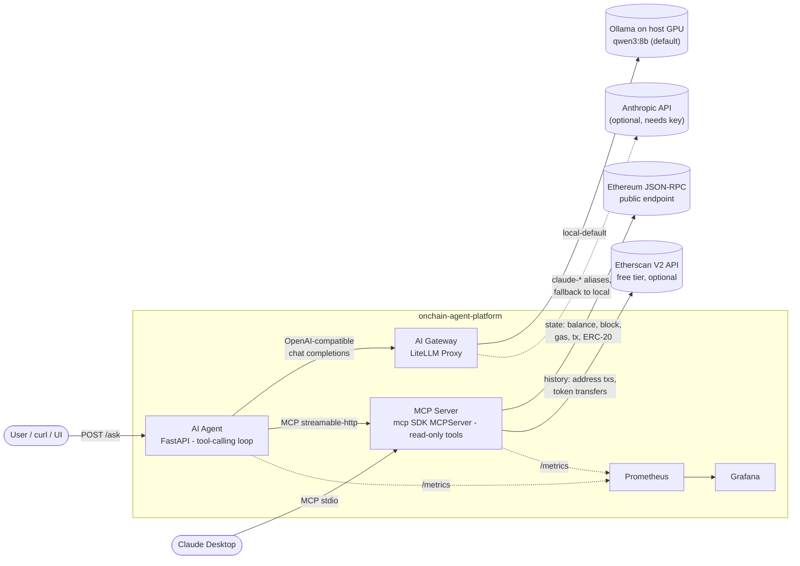
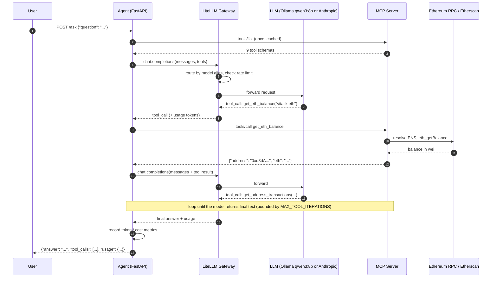
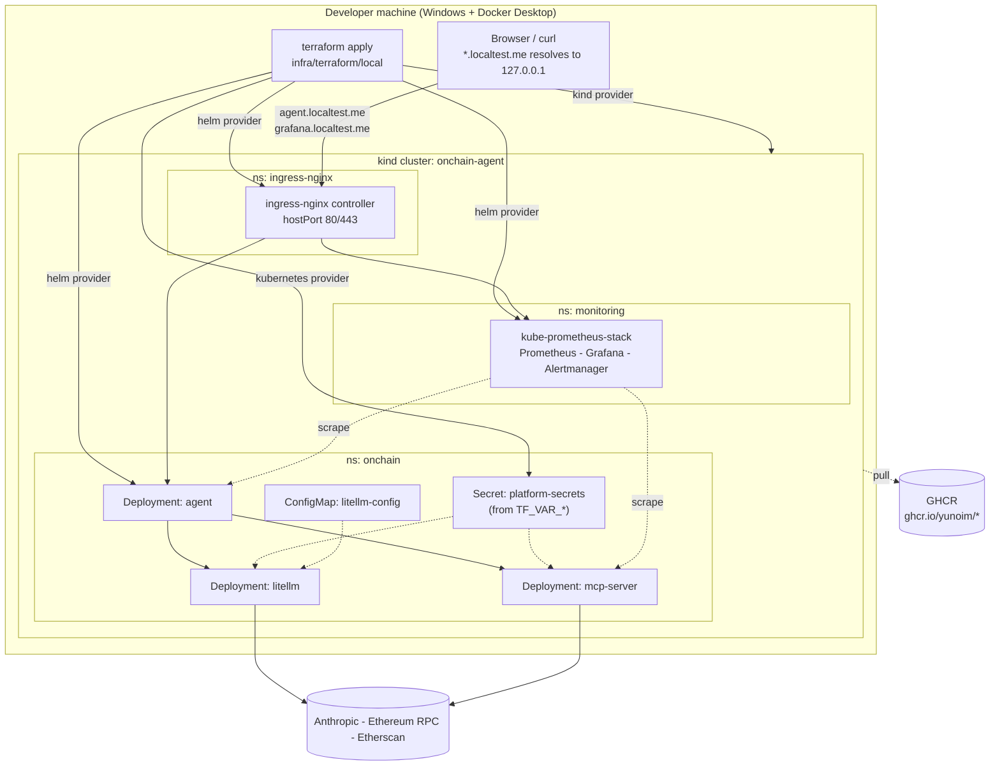

# Architecture

This document is the single place where the shape of the system is explained.
Design decisions with trade-offs live in [`docs/adr/`](adr/); concepts learned
while building live in [`LEARNING.md`](LEARNING.md).

## 1. Problem statement

AI agents are good at reasoning over data but cannot see a blockchain on their
own. Giving an LLM raw RPC access is dangerous (it could be talked into signing
or sending) and impractical (a public RPC has no per-address history index).

This platform gives an agent a **read-only, tool-shaped view of Ethereum**
through the Model Context Protocol (MCP), routes every LLM call through a
gateway that enforces model policy and records cost, and deploys the whole
thing on Kubernetes in a way that can be recreated with one `terraform apply`.

Non-goals: wallets, private keys, signing, transaction submission, trading.
See [ADR-0001](adr/0001-read-only-onchain-access.md).

## 2. System context



Key properties:

| Property | How it is achieved |
|---|---|
| Read-only | MCP server imports no signing modules; no private-key config exists ([ADR-0001](adr/0001-read-only-onchain-access.md)) |
| Works on free tiers | State from public RPC; history from Etherscan free key; log scans bounded to at most 2000 blocks ([ADR-0002](adr/0002-two-tier-data-sources.md)) |
| One codebase, two transports | Same MCP tools served over stdio (Claude Desktop) and streamable-http (in-cluster) ([ADR-0003](adr/0003-mcp-dual-transport.md)) |
| Provider-agnostic agent | Agent only speaks the OpenAI-compatible API to LiteLLM; routing, limits and cost live in the gateway ([ADR-0004](adr/0004-litellm-gateway.md)) |
| Zero-cost by default | `local-default` alias routes to Ollama on the host; hosted aliases activate when a key is present ([ADR-0007](adr/0007-local-first-model-routing.md)) |
| Reproducible infra | `infra/terraform/local` creates the kind cluster and all Helm releases in one apply ([ADR-0005](adr/0005-terraform-layering.md)) |
| Images reach the cluster | CI pushes to GHCR; pre-CI local builds use `kind load` ([ADR-0006](adr/0006-image-delivery.md)) |

## 3. Request sequence

Example: *"Summarize the recent activity of vitalik.eth."*



The loop is bounded so a confused model cannot burn the RPC quota or the LLM
budget.

## 4. Deployment topology (local, kind)



Two layers are deliberately separated ([ADR-0005](adr/0005-terraform-layering.md)):

- **Cluster layer**: *where* things run. Local: kind. Cloud: EKS (`infra/terraform/aws-eks`, plan-only by default).
- **Platform layer**: *what* runs. `infra/terraform/modules/platform` installs ingress, monitoring and the application chart. The same module is consumed by both roots.

## 5. Repository layout

```
onchain-agent-platform/
├── CLAUDE.md                  # working rules + phase progress log
├── docs/
│   ├── ARCHITECTURE.md        # this file
│   ├── LEARNING.md            # K8s / Helm / Terraform concepts, accumulated per phase
│   ├── DEMO.md                # demo script (Phase 6)
│   └── adr/                   # architecture decision records
├── services/
│   ├── mcp-server/            # Python - mcp SDK 2.x - web3.py 8 - pytest
│   ├── agent/                 # Python - FastAPI - MCP client - OpenAI SDK
│   └── gateway/litellm/       # LiteLLM proxy config (no code)
├── deploy/
│   ├── kind/                  # cluster.yaml (port mappings for ingress)
│   ├── helm/                  # umbrella chart: onchain-agent-platform
│   └── observability/         # Grafana dashboards, alert rules
├── infra/terraform/
│   ├── modules/platform/      # ingress-nginx + kube-prometheus-stack + app chart
│   ├── local/                 # kind cluster + platform module  (apply: yes)
│   └── aws-eks/               # VPC + EKS + platform module     (plan only)
├── scripts/                   # kind-load, smoke tests
└── .github/workflows/         # lint - test - build to GHCR - helm lint - tf validate
```

## 6. MCP tool catalogue

| Tool | Source | Notes |
|---|---|---|
| `get_eth_balance(address)` | RPC | ENS names resolved |
| `get_block(number_or_tag)` | RPC | `"latest"` supported |
| `get_gas_price()` | RPC | base fee + priority fee estimate |
| `get_transaction(tx_hash)` | RPC | includes receipt status |
| `get_erc20_token_info(contract)` | RPC | name / symbol / decimals / totalSupply |
| `get_erc20_balance(contract, address)` | RPC | |
| `get_recent_token_transfers(contract, blocks, min_amount)` | RPC `eth_getLogs` | range capped at 2000 blocks for free-tier RPC |
| `get_address_transactions(address, limit)` | Etherscan V2 | clear error if no API key |
| `get_address_token_transfers(address, limit)` | Etherscan V2 | clear error if no API key |

Demo questions the platform must answer end-to-end (Phase 2 onward):

1. "What is the ETH balance of vitalik.eth and what were its last 5 transactions?"
2. "Find USDC transfers above 1,000,000 USDC in the last 2000 blocks."
3. "What is the current gas price and the latest block number?"
